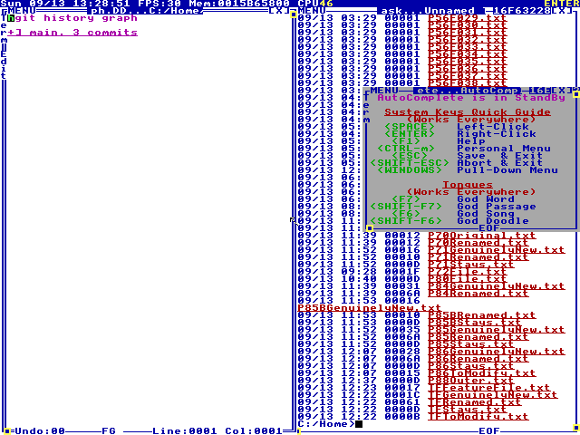

<p align="center">
  
</p>

<h1 align="center">hgit</h1>

<p align="center">
  A version-control system written in HolyC, native to TempleOS —
  persistent file/symbol identity, executable DolDoc reconciliation,
  truthful non-destructive history, and a consistent modern CLI.
</p>

<p align="center">
  <a href="https://github.com/VectorSophie/hgit/releases/latest"></a>
  <a href="https://github.com/VectorSophie/hgit/actions/workflows/lint.yml"></a>
  <a href="docs/research/01-templeos-holyc.md"></a>
  <a href="docs/research/08-qemu-testing.md"></a>
  <a href="docs/research/08-qemu-testing.md"></a>
  <a href="INSTALL.md"></a>
</p>

<p align="center">
  <a href="INSTALL.md">Install</a> ·
  <a href="#what-hgit-actually-does">Commands</a> ·
  <a href="#the-graph">The graph</a> ·
  <a href="#how-hgit-differs-from-git">vs. Git</a> ·
  <a href="docs/ARCHITECTURE.md">Architecture</a> ·
  <a href="docs/adr/">ADRs</a>
</p>

M0 through M4 of the milestone plan are complete and independently
verified on real TempleOS under QEMU — object storage, the full
command surface, stable entity identity across renames, and executable
DolDoc reconciliation views. Real subdirectory support (`offertree`/
`statustree`, ADR 0010) and a real three-way `merge` command (ADR
0011) have since shipped too. See `docs/STATUS.md` for a current
top-level snapshot (what's solid, what's genuinely still open) or
`docs/research/10-product-proposal.md` for the live, dated,
self-correcting record of what's actually built — nothing here is
claimed without a real, re-runnable test behind it.

The whole toolchain packages into one file (`packaging/HgitAll.HC`),
loadable with a single `#include` — there is no argv/shell syntax in
TempleOS to build a traditional CLI around (confirmed from primary
source), so `Hgit(cmdline)` is the idiomatic shape, not a workaround.

## Try it

Every line below is a real command, run against a real TempleOS
instance under QEMU — not a mockup:

```c
#include "C:/Home/HgitAll.HC";

Hgit("init C:/Home/P80Repo.hgs");
Hgit("offer C:/Home/P80Repo.hgs P80File.txt offer_one");
Hgit("offer C:/Home/P80Repo.hgs P80File.txt offer_two");

Hgit("path new C:/Home/P80Repo.hgs feature");
Hgit("path go C:/Home/P80Repo.hgs feature");
Hgit("offer C:/Home/P80Repo.hgs P80File.txt offer_on_feature");
Hgit("path go C:/Home/P80Repo.hgs main");

Hgit("graph C:/Home/P80Repo.hgs C:/Home/P80Graph.DD");
```

Real output from that exact sequence (`experiments/81-hgit-graph/`):

```
DISPATCH_OK init C:/Home/P80Repo.hgs
DISPATCH_OK offer
DISPATCH_OK offer
DISPATCH_OK path_new feature
DISPATCH_OK path_go feature
DISPATCH_OK offer
DISPATCH_OK path_go main
DISPATCH_OK graph
```

## What hgit actually does

Every command below is real, dispatched, and independently verified
on TempleOS under QEMU — not a design sketch. Run `hgit help` (once
loaded) for the same list straight from the live dispatcher.

| Command | What it does |
|---|---|
| `init` | Create a new, empty repository |
| `offer` | Snapshot matching files as a new commit (hgit's own name for git's "commit") — honors `.hgitignore` (ADR 0014): an ignore rule only ever hides a genuinely untracked name, never an already-tracked one |
| `offertree` / `statustree` | Real subdirectory support (ADR 0010) — `offer`/`status`, recursing into nested directories, as separate commands rather than changing `offer`/`status`'s own flat semantics; also honor `.hgitignore` (ADR 0014), including a whole ignored subdirectory (`build/`) never even being recursed into |
| `status` | Compare the working directory against HEAD — new/modified/deleted, **and renamed** (exact-content match, ADR 0009) |
| `merge` | A real three-way merge between two named paths (ADR 0011), content and file mode (ADR 0015) both merged independently — a genuine conflict (content or mode) aborts the whole merge, zero side effects; no resolution mechanism yet |
| `history` | Walk the current path's commit chain |
| `graph` | Render the entire commit history across every path as a real, collapsible DolDoc tree — see below |
| `see` / `diff` | Show one commit's tree/message/relation, or what changed relative to its parent — both recurse into nested trees |
| `check` | Repo integrity: hash verification, referential integrity (`git fsck`-style missing-object check), **and dangling/unreachable-object detection** — all correctly recurse into nested trees too |
| `undo` / `redo` | Step through the operation log — reversible, not destructive |
| `operation history` / `operation restore` | Full operation-log vocabulary — jump to any past point |
| `path list` / `new` / `go` / `close` | Named, branch-like alternate histories sharing one object store |
| `correct` / `revert` / `reconcile` (+ `...tree` variants) | Typed relations between commits (ADR 0005/0006) — a commit can *point at* another with real semantics, optionally scoped to one tracked entity; the `...tree` forms carry the same relation on a recursive, `offertree`-style offer |
| `historydoc` / `reconciledoc` / `reconcileoverview` | Executable DolDoc views — real rendered documents (colored, with live `$LK$` links and collapsible `$TR$` trees), not plain text logs |
| `export` / `import` | Whole-repo portability, own paths and history intact |
| `help` / `version` / `logo` | Discoverability and a bit of fun |

## Ignore rules

A `.hgitignore` file (one per repository, next to the files it
governs) keeps generated/temporary files out of `offer`/`offertree`/
`status`/`statustree` without excluding them by hand every time. A
small, deliberately smaller-than-`.gitignore` grammar (ADR 0014,
`docs/adr/0014-ignore-rules.md`):

```text
*.tmp           # a name pattern (glob, any depth)
build/          # a directory pattern (any depth, whole subtree)
generated/*     # anchored to the repo root - direct children only
!important.hc   # negation - the LAST matching line wins
```

**The one rule that matters most: ignore only ever hides discovery of
untracked material. It never conceals an already-tracked file** — add
a `build/` rule after `build/output.txt` is already committed, and
`output.txt` stays fully tracked and visible until you actually delete
it. `.hgitignore` itself is an ordinary trackable file, not special
metadata — include it in your own `offer` if you want it versioned.

## File attributes and modes

A `.hgitattributes` file (same directory, same glob grammar as
`.hgitignore`) declares a tracked file's real mode — TempleOS has no
Unix permission bits or execute bit, so `text`/`binary`/`executable`
are only ever set explicitly, never guessed for `executable` (ADR
0015, `docs/adr/0015-file-attributes-and-modes.md`):

```text
*.png binary
*.HC text,executable
build/* binary
```

Binary detection otherwise falls back to auto-detection — the same
NUL-byte-in-the-first-8000-bytes heuristic Git's own `is_binary` uses
— for any file no rule matches. Mode is stored as a commit-level
side-channel keyed by entity ID (independent of path/content, same as
the identity ADR 0004 already gives every tracked name), not embedded
in tree entries, and costs nothing for a repo where every file is
plain text and non-executable. `status`/`statustree` and `diff` both
surface a mode change independently of any content change —
`STATUS_MODE_CHANGED`/`DIFF_MODE_CHANGED <path> <old> -> <new>` — and
`check` validates the mode list's own referential integrity the same
way it does every other object reference.

## The graph

`hgit graph` walks every declared path (not just the current one) and
renders the whole commit history as a real, native DolDoc tree — the
same collapsible `$TR$` widget TempleOS itself ships, not an ASCII
approximation. One collapsible node per **branch** (the trunk, and
each other path), with that branch's own commits as plain lines inside
it — not one node per commit, which would look fine collapsed but
swallow every ancestor's own label the moment you expanded deep enough
(a real property of nested `$TR$` widgets, discovered the hard way —
see `experiments/81-hgit-graph/`). Every other path attaches its own
branch node at the exact commit it forked from. Reformatted for
readability, the document produced by the sequence above looks like
this:

```
hgit history graph

[+] main, 3 commits
      468bbd6656 offer_one
      0c6b94e6ba offer_two
      [+] [feature] 1 commits
            b0598745e9 offer_on_feature
```

Real screenshot, collapsed (`Ed()`, the exact document `hgit graph`
produces):

<p align="center">
  
</p>

Collapsed by default (DolDoc's own convention, confirmed from real
shipped TempleOS docs, probe 57 — not an hgit limitation), one real
click away from expanded — `experiments/81-hgit-graph/`'s own research
into TempleOS's `DocEntryRun`/`cur_entry` mechanism got a real,
successful expansion working and screenshotted for an earlier version
of this feature. This project's headless QEMU harness drives
everything through scripted keyboard/serial injection rather than a
mouse, so a fresh expanded screenshot of this exact redesign is still
an open item — the probe's own README has the honest, dated account of
what's captured so far and what isn't.

## How hgit differs from Git

Not a Git clone wearing a different hat — a few real, deliberate
departures, each backed by a decision doc:

| | Git | hgit |
|---|---|---|
| **File identity** | Path-based — a rename is a heuristic guess Git makes *after the fact*, from a similarity score | A stable **entity ID** travels with a tracked thing across renames, content changes, and generations (ADR 0004), independent of its current name |
| **History editing** | `rebase`/`reset --hard`/`git gc` can genuinely destroy commits; recovery means `reflog` archaeology before the grace period expires | Nothing is ever deleted. `undo` moves a pointer. A commit nobody points to anymore just sits there — `hgit check` will tell you it's dangling, not that it's gone |
| **Relations between commits** | A plain parent-pointer DAG — "this corrects that" lives in a commit message, if anywhere | Typed relations (`correct`/`revert`/`reconcile`, ADR 0005/0006) are real fields on the commit object, optionally scoped to one tracked entity |
| **Viewing history** | Plain text (`log`), or a third-party GUI | Executable **DolDoc** documents — real rendered files with live links and collapsible trees, generated by hgit itself |
| **Distribution** | A compiled binary + installer per platform | One `.HC` source file, `#include`d — matches TempleOS's own convention of no compiled binaries at all |
| **Renames** | Similarity-scored heuristic (`-M50%` by default) | Exact-content match (ADR 0009), plus real fuzzy detection for a rename-with-edit (`FossilSimilarityPercent`, ADR 0008, wired into `Offer.HC`) |

None of this makes hgit a *replacement* for Git — it makes it a
different answer to the same problem, built for a system (TempleOS)
where none of Git's own accumulated compatibility debt (packfile
formats, sharded object directories, POSIX permission bits) applies in
the first place.

## Why a burning bush?

Exodus 3: a bush burns and is never consumed. TempleOS's own creator,
Terry Davis, built an entire OS on the premise that God speaks in
640×480 and 16 colors, and was never shy about saying so — HolyC,
"the Third Temple," the whole thing. hgit doesn't share the theology.
It steals the one line that happens to describe what the tool
actually does: **history burns here, and it is never consumed.**

Every programmer has stood in front of a scorched `git reflog`,
whispering "please still be in there" after a bad rebase. hgit's
answer is structural, not miraculous: `undo` moves a pointer, it
doesn't delete anything; `hgit check` will happily tell you about
commits nobody points to anymore, because they're still just sitting
there, unharmed, in the fire. No revelation required — just an object
store that never actually throws anything away.

(We asked Terry for a code review. He'd probably have notes. We're
taking the fifth on test coverage.)

## Releases

Every tagged release attaches `packaging/HgitAll.HC` — verified
downloaded and byte-identical to the local build before being
announced done (matches TempleOS's own convention: no installer, a
program is `#include`d as one source file). Major versions now mark
real product milestones rather than every single change getting its
own tag (`docs/research/09-packaging-and-releases.md`). The
[current release](https://github.com/VectorSophie/hgit/releases/latest)
also attaches a real, ready-to-run TempleOS+hgit bundle
(`templeos-hgit.qcow2` + `hgit-launch.py`) for trying hgit on
Windows/Linux/macOS without your own TempleOS install — see
`packaging/bundle/README.md`. See the
[Releases page](https://github.com/VectorSophie/hgit/releases) for the
full, dated history.
