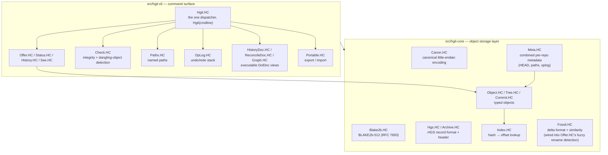
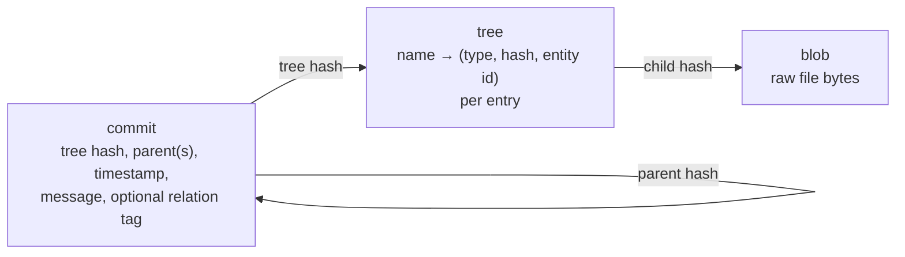
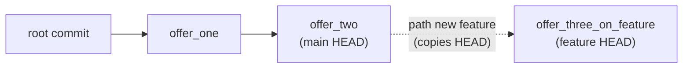

# Architecture

Moved out of `README.md` to keep the front page short — this is the
file-by-file map and the internal shape. For the dated, narrated
history of *how* each piece got built and verified (probe by probe,
with real test evidence), see `docs/research/10-product-proposal.md`;
this file is the *current-state* map, not the history.

## Module layout

Every file in both directories has been independently verified running
on real TempleOS via `experiments/01-temple-repl/`'s injection channel
— see each probe's own `README.md` for the exact evidence, and each
source file's own header comment for which probe verified it.

## Object model

Content-addressed, same base shape as Git's own object model (see
`docs/research/05-git-internals-and-product-practice.md` for what was
deliberately kept vs. left out):

The one addition beyond Git's own model: every tree entry carries a
stable **entity ID** (ADR 0004), independent of the entry's current
name or content — this is what lets `correct`/`revert`/`reconcile`
(ADR 0005/0006) and exact-content rename detection (ADR 0009) refer to
"this specific tracked thing" rather than "whatever's at this path
right now."

## Paths: hgit's branch-shaped thing

`path new <name>` copies the current path's HEAD into a new named
pointer sharing the same object store — there's no full merge/DAG
model yet (no multi-parent commits exist), so a "branch" here is
exactly this: a second HEAD pointer with a real, findable fork point.
`hgit graph` renders exactly this structure.

## Repo layout

- `docs/research/` — the research dossier; per-doc status in
  [`00-research-index.md`](research/00-research-index.md). Most docs
  are partial; check that index before assuming coverage.
- `docs/adr/` — one file per architectural decision, each backed by
  working, tested code at the time it was written (never speculative).
- `experiments/` — one directory per probe: what was tried, the exact
  result, what's still open, and (where relevant) the exact HolyC
  source that was pushed and verified on real TempleOS.
- `FORMAT.md` — the `.HGS` repository/archive format, byte-for-byte.
- `src/hgit-core/` — the object storage layer (see diagram above):
  `Canon.HC`, `Blake2b.HC`, `Archive.HC`/`Hgs.HC`, `Object.HC`/
  `Tree.HC`/`Commit.HC`, `Index.HC`, `Meta.HC`, `Fossil.HC` (delta
  format + similarity measure, reliable, wired into `Offer.HC`'s fuzzy
  rename detection — object-store delta compression itself remains a
  separate, real decision; see `docs/adr/0008-fossil-delta-format-prototype.md`).
- `src/hgit-cli/` — the command surface: `Init.HC`, `Check.HC`,
  `WorkDir.HC`, `Paths.HC`, `Offer.HC`, `Status.HC`, `History.HC`,
  `See.HC`, `Hex.HC`, `HistoryDoc.HC`, `ReconcileDoc.HC`, `Graph.HC`,
  `OpLog.HC`, `Portable.HC`, `Logo.HC`, and `Hgit.HC` — the real entry
  point (`Hgit(cmdline)`) composing all of the above behind one
  dispatcher.
- `tools/build-package.sh` — concatenates every `src/hgit-core/` and
  `src/hgit-cli/` file, in dependency order, into
  `packaging/HgitAll.HC` — the actual distributable.
- `tools/lint-package.sh` — host-side HolyC lint (`holyc-parser`)
  before paying the ~1-minute QEMU round trip; catches real classes of
  error (name collisions, cross-file reference mistakes) — see
  `docs/research/07-portability-and-toolchains.md` for what it does
  and doesn't catch.

## Why not just fork Git's own design one-for-one?

TempleOS's own stated constraints ruled a few things out early — see
`docs/research/01-templeos-holyc.md` and `06-storage-hashing-compression.md`
for the evidence behind each:

- **No 2-char/38-char sharded object directories** — a filesystem-
  scaling trick irrelevant at TempleOS's own ~100MB-repo philosophy.
- **No packfile/delta-compressed object storage yet** — `Fossil.HC`'s
  delta format is built, correct, and now used (for rename similarity,
  not object storage); actually compressing the object store with it
  remains a separate, real decision.
- **No merge/three-way-merge model** — no multi-parent commits exist;
  `path`s are hgit's own simpler branch-shaped primitive instead.
